# Paper Crypto Coach — User Guide

In-app guide (recommended): sign in and open **[/guide](/guide)** (Help icon in the header, or **Settings → Open User Guide**).

Illustrations live in `apps/web/public/guide/`.

## Before you start

- **Paper only** — simulated money. Nothing here places live exchange orders.
- **Sign in** — register with email/password, or Google when enabled. Seeded demo (local): `demo@example.com` / `Demo1234!`.
- **Starting cash** — new paper accounts default to **$20,000** simulated USD (editable in Settings; reset restores that balance).
- **Your data stays yours** — Lab hypotheses, backtests, and Coach/AUTO preferences are stored **per account on the server** (MySQL). Other users cannot see or run your Lab profiles.
- **Free vs Pro** — Free can generate versions, run backtests, and **Save paper profile** (promote) for Market/Coach AUTO. Pro billing is optional later; paper testing is not gated on Stripe.
- **AUTO is not 24/7 server-side** — ticks run in the **browser** on a timer while **Market** or **Coach** stays open. Closing the tab pauses AUTO.
- **Lab backtests** apply ~**0.80% fee per fill** (plus small spread/slippage). A **REJECT** verdict is common and normal — it is not a bug.
- **Chart EMAs** — periods from your Lab prompt (`chart_emas`) draw on the **Market** chart when that promoted profile is selected (visual context only).
- **Assets** — paper catalog includes BTC, ETH, SOL, and many other listed coins. Lab rule parsing currently supports BTC/ETH/SOL/XRP/BNB/ADA pairs; pick a Market symbol that matches your profile.

English-only UI.

## Lab → AUTO (important)

Paper signals and AUTO use **Hypothesis Lab** profiles only:

1. **Lab** — prompt → generate version → backtest → **Save paper profile**
2. **Settings** — interval, stake, leverage, SL/TP for AUTO risk (saved to your account)
3. **Market** or **Coach** — choose the promoted profile, turn AUTO on, **keep the page open**
4. Review in **Portfolio / History / Journal / Analytics**

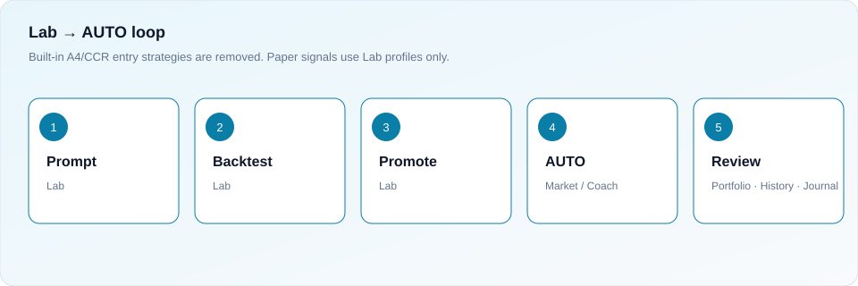

AUTO evaluates closed candles and fills eligible longs at the next candle open.

---

## Dashboard

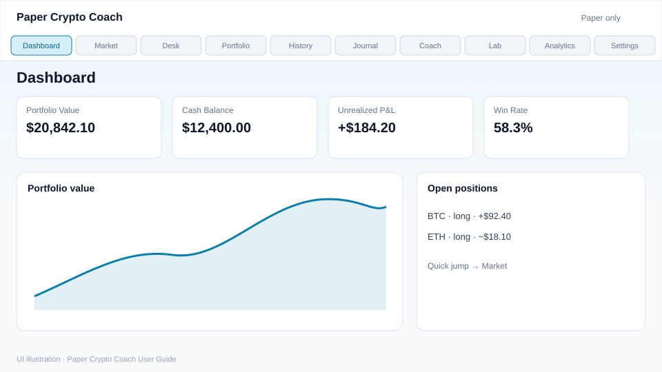

- **For:** Portfolio overview, P&L, equity path, open positions.  
- **Do:** Scan daily risk, then jump to Market.  
- **Connects:** Summarizes Portfolio and History.

## Market

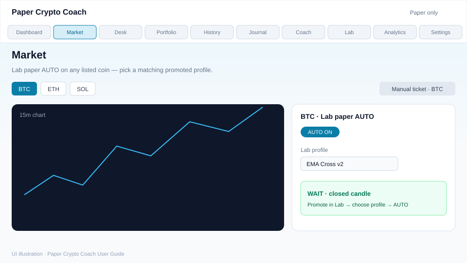

- **For:** Charts + Lab paper AUTO per symbol; EMA overlays from the selected Lab profile.  
- **Do:** Pick symbol → choose promoted Lab profile → AUTO on (or Manual ticket). Keep the tab open for ticks.  
- **Connects:** Profiles from Lab; risk from Settings; fills → Portfolio/History.

## Desk

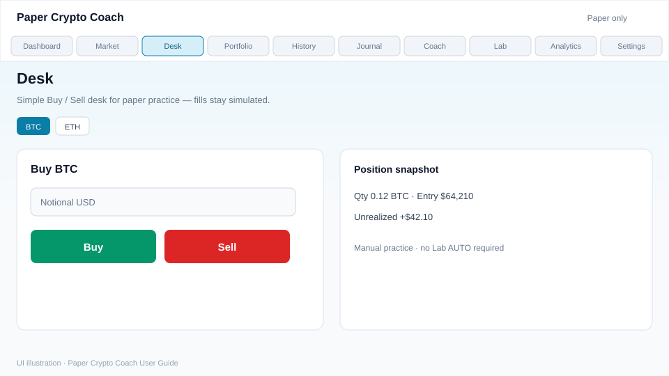

- **For:** Simple manual Buy/Sell paper practice.  
- **Do:** Size notional and trade.  
- **Connects:** Independent of Lab AUTO; still feeds History/Analytics.

## Portfolio

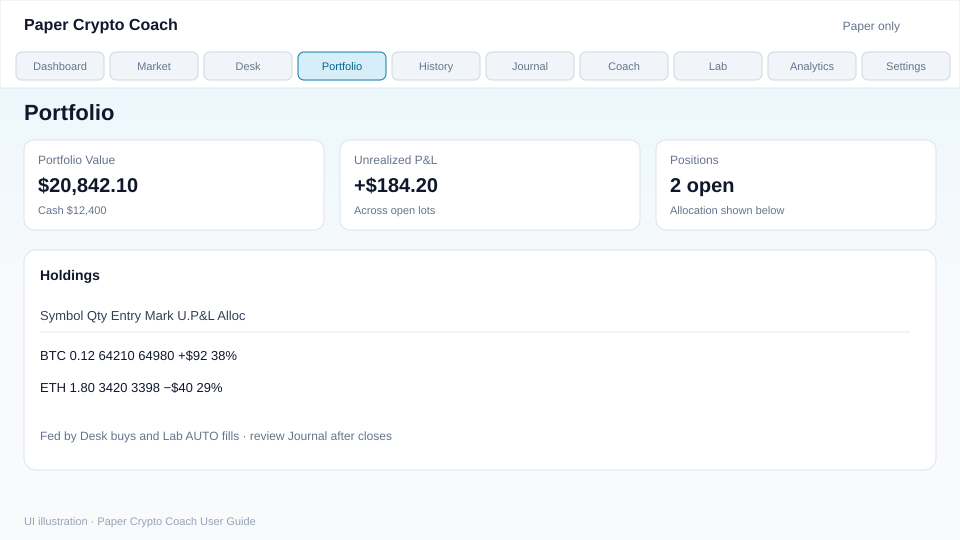

- **For:** Open holdings, allocation, unrealized P&L.  
- **Do:** Inspect lots before adding risk.  
- **Connects:** Desk + Lab AUTO fills.

## History

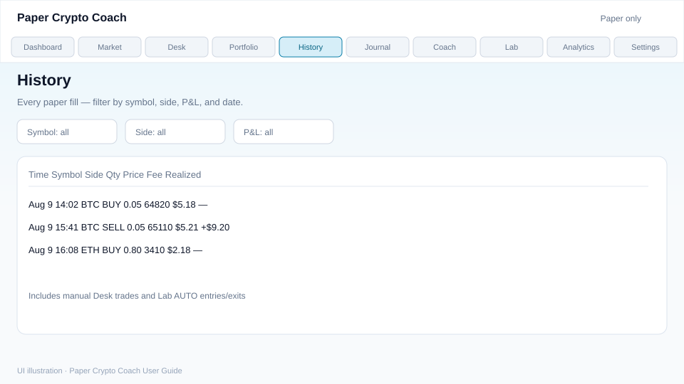

- **For:** All paper fills with filters.  
- **Do:** Review winners/losers and fees.  
- **Connects:** Feeds Analytics; pairs with Journal.

## Journal

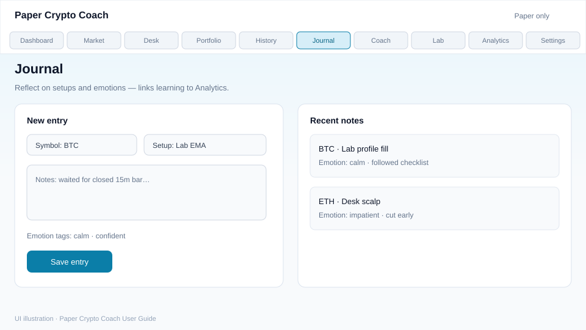

- **For:** Setup notes and emotion tags.  
- **Do:** Log after important trades.  
- **Connects:** Emotion breakdowns in Analytics.

## Coach

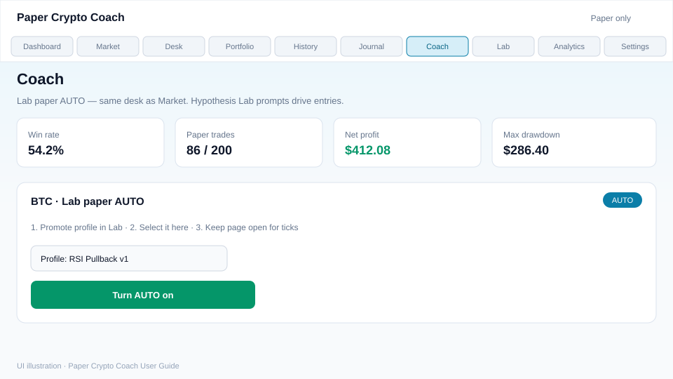

- **For:** Practice stats + same Lab AUTO desk as Market.  
- **Do:** Select promoted profile, keep page open for ticks.  
- **Connects:** Lab profiles only. Outcomes → Portfolio/History.

## Lab

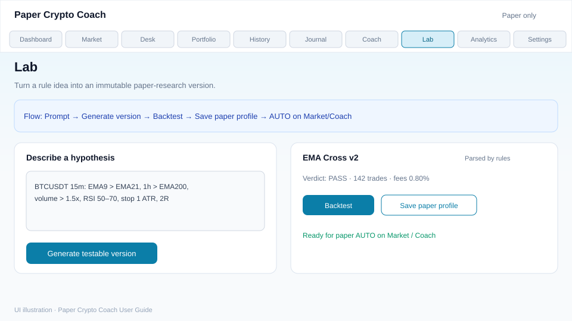

- **For:** Research hypotheses into immutable paper profiles (per account).  
- **Do:** Prompt → Generate → Backtest (0.80% fees; REJECT is common) → Save paper profile. Use the **Trade-to-Live** template when you want a single high-quality setup (trend → S/R zones → closed-bar confirmation → RR ≥ 1:2). Incomplete setups should stay **WAIT / NO TRADE**.  
- **Connects:** Only promoted profiles drive Market/Coach AUTO. Chart EMAs from the prompt appear on Market when selected.

### Trading Analysis Assistant (paper practice)

The Lab/Coach path is built to **select quality setups**, not to force trades:

1. **Trend** — clear uptrend/downtrend bias (EMA / HTF); unclear → WAIT  
2. **S/R zones** — watch zones, never enter on touch alone  
3. **Confirmation** — closed lower-timeframe bar (rejection / reclaim / defense)  
4. **Risk/Reward** — planned RR at least **1:2** or NO TRADE  
5. **Decision** — BUY/LONG, SELL/SHORT, WAIT, or NO TRADE with reasons  

This is a **practice philosophy** (“trade to live,” ~1–3 quality paper setups/week). It is **not** a promise of income, weekly %, or live exchange results.

## Analytics

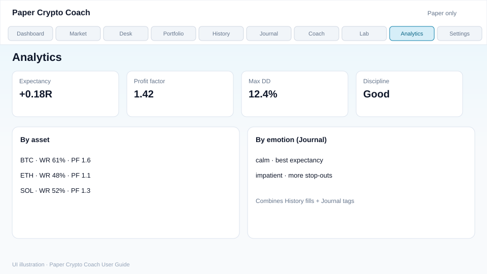

- **For:** Expectancy, PF, drawdown, by asset / by emotion.  
- **Do:** Decide which Lab profiles deserve more paper size.  
- **Connects:** History + Journal.

## Settings

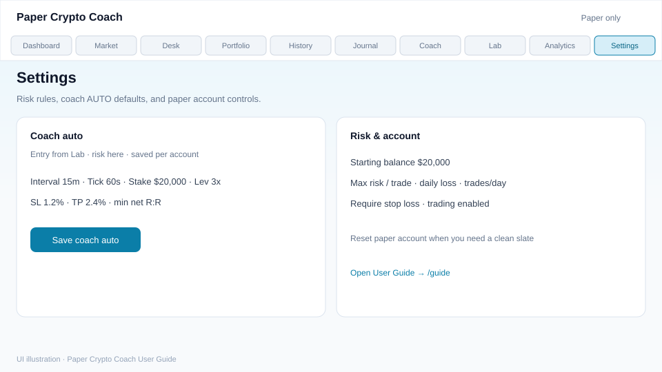

- **For:** Risk limits and coach AUTO defaults; paper reset; link to this guide.  
- **Do:** Set interval/stake/SL/TP (stored on your account); open User Guide from here.  
- **Connects:** Risk for AUTO; entry rules still come from Lab.

---

English-only UI. Paper trading only — never real funds.
